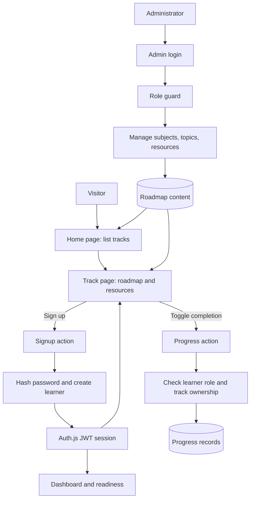

# Roadmap.io Project Guide

This document describes the product, application flows, data model, security boundaries, development workflow, and deployment architecture implemented in this repository. It is intended as a handoff guide for a developer continuing work started with another coding agent.

## Project at a Glance

Roadmap.io is a learning-roadmap platform. Administrators create learning tracks and organize their content into milestones, topics, and subtopics. Visitors can browse roadmaps without an account. Learners create accounts, mark topics complete, and see progress and career-readiness estimates. The admin area manages the roadmap content.

The application is a server-rendered Next.js App Router project. Server Components load database-backed pages; Server Actions perform mutations; Auth.js provides credential-based authentication; Drizzle defines and queries the database. The same schema is used with local SQLite and production Turso/libSQL.

| Area | Implementation |
| --- | --- |
| Web framework | Next.js 16 App Router, TypeScript, React 19 |
| UI | Tailwind CSS v4, shadcn/ui-style components, Base UI, Lucide icons |
| Authentication | Auth.js credentials provider, bcryptjs password hashing, JWT sessions |
| Data access | Drizzle ORM |
| Local database | SQLite through better-sqlite3 |
| Hosted database | Turso/libSQL through @libsql/client |
| Main hosting | Vercel, connected to the GitHub repository |
| Optional self-hosting | Docker Compose on an EC2 instance provisioned with Terraform |
| Tests | Vitest unit tests and Playwright smoke tests |

## User and Administrator Flows

### Visitor: browse a roadmap

1. The visitor opens `/`.
2. The home page loads the available subjects from the database and displays them as tracks.
3. Selecting a track opens `/tracks/[slug]`.
4. The track page loads its subject, ordered topics, and attached resources, then renders the roadmap in `RoadmapTree`.
5. Anonymous visitors can inspect the track and resources. The progress controls are interactive only for an authenticated learner; visitors are invited to sign up.

### Learner: create an account and track progress

1. The learner opens `/signup` and submits a name, email, and password.
2. The signup Server Action normalizes the email, requires a password of at least eight characters, applies an IP-based rate limit, and returns a generic error for an existing email so account registration is not disclosed.
3. The password is hashed with bcryptjs before the learner row is stored. The new user receives the `learner` role and is signed in through Auth.js.
4. The learner lands on `/dashboard`. The dashboard displays each subject's completion count, overall completion percentage, and Fresher/Intermediate/Expert readiness percentages.
5. Opening `/tracks/[slug]` as a learner loads that learner's completion records for the track. Marking a topic complete inserts a progress row; unchecking it deletes that learner's row.
6. The progress action checks the session role, verifies that the topic belongs to the requested track, and always scopes reads/deletes to the current session user. The track and dashboard paths are revalidated after the mutation.

### Returning learner: sign in

1. `/login` submits credentials to the login Server Action.
2. A rate limit is checked by IP and by IP plus email.
3. Auth.js finds the user and compares the submitted password with the stored bcrypt hash. Failed credentials return a generic invalid-credentials message.
4. Auth.js creates a JWT session carrying the user ID and role. The session callback exposes those values server-side to route guards and actions.
5. The learner is redirected to the requested destination, defaulting to `/dashboard`.

### Administrator: manage roadmap content

1. An administrator signs in at `/admin/login` using an account whose database role is `admin`.
2. `proxy.ts` protects `/admin/*` except the login page itself. Authenticated admins are redirected from the login page to `/admin`; non-admins cannot access admin pages.
3. The admin creates a subject (track). The server action derives its slug from the title and records the creator.
4. Within a subject, the admin creates milestones/topics/subtopics, assigns their structural level and career level, and can attach article, video, or documentation resources.
5. Create/delete actions verify the admin role on the server and revalidate the affected admin route. Subject and topic deletion behavior follows the configured database foreign-key rules.

### Flow diagram

## Routes and Responsibilities

| Route | Audience | Responsibility |
| --- | --- | --- |
| `/` | Public | List published subjects/tracks |
| `/tracks/[slug]` | Public and learner | Render a roadmap; show interactive progress to learners |
| `/signup` | Signed-out visitor | Create a learner account |
| `/login` | Signed-out visitor | Sign in |
| `/admin/login` | Signed-out administrator | Sign in to admin area |
| `/admin` | Administrator | List and manage subjects |
| `/admin/subjects/[id]` | Administrator | Manage topics and resources within a subject |
| `/dashboard` | Learner | Show per-track progress and readiness |
| `/api/auth/[...nextauth]` | Auth.js | Auth.js protocol endpoints |

Database-backed pages declare dynamic rendering so build environments do not need a live database and personalized pages are not prerendered as static content.

## Data Model

The Drizzle schema lives in `lib/db/schema.ts`; migration SQL lives in `drizzle/`.

| Table | Purpose and important fields |
| --- | --- |
| `users` | Name, unique email, bcrypt password hash, role (`admin` or `learner`), creation time |
| `subjects` | A roadmap track: unique slug, title, description, color, display order, optional creator |
| `topics` | Roadmap nodes belonging to a subject; optional parent node; structural `level`; independent `careerLevel`; display order |
| `resources` | Ordered article/video/doc links attached to a topic |
| `progress` | User/topic completion and completion time; unique user/topic pair prevents duplicates |

Two topic fields named `level` and `careerLevel` represent different concepts. `level` is the content tree shape (`milestone`, `topic`, or `subtopic`). `careerLevel` marks expected job-readiness depth (`fresher`, `intermediate`, or `expert`).

The self-referencing parent field connects nested roadmap nodes. A subject owns its topics; topics own resources and progress records. Deleting a subject or topic cascades to dependent content/progress where configured by the schema.

## Progress and Readiness Calculation

Overall track completion is the number of completed topic records divided by the total topics in the subject. The dashboard separately computes readiness for each career tier in `lib/readiness.ts`:

- Fresher readiness uses topics tagged `fresher`.
- Intermediate readiness uses `fresher` and `intermediate` topics.
- Expert readiness uses all three levels.
- A tier with no required topics is reported as 0%.
- Each value is the rounded percentage of required topics completed.

The career-level rank is cumulative: foundational fresher topics count toward intermediate and expert readiness. This is an estimate based on checklist completion, not a verified skills assessment.

## Application Architecture

### Request and mutation path

1. Next.js resolves an App Router page or Server Action.
2. Server Components call focused query helpers in `lib/data.ts`.
3. `lib/db/client.ts` constructs a Drizzle client over Turso when `TURSO_DATABASE_URL` is set; otherwise it lazily loads better-sqlite3 and opens the local SQLite path.
4. Server Actions validate session/role and request ownership before writes.
5. Mutations revalidate affected paths so subsequent page requests read current data.

### Authentication and authorization

Auth.js is configured in `lib/auth.ts` with the credentials provider and JWT sessions. Passwords are never stored as plaintext. The JWT callback copies the role into the token; the session callback exposes the user ID and role for server-side authorization.

Authorization is enforced at the server boundary, not only by hiding UI. The route proxy protects admin and dashboard page paths. Admin Server Actions independently require the admin role. Progress actions require the learner role and derive the user ID from the session, so a request cannot choose another learner's progress owner.

### Key code locations

| Path | Responsibility |
| --- | --- |
| `app/` | App Router pages, layouts, auth endpoints, and Server Actions |
| `app/actions/auth.ts` | Signup and login, hashing, generic signup response, rate limits |
| `app/actions/admin.ts` | Admin-only subject/topic/resource mutations |
| `app/actions/progress.ts` | Learner-only progress mutations and ownership checks |
| `components/roadmap/roadmap-tree.tsx` | Interactive roadmap/trail visualization |
| `lib/auth.ts` and `proxy.ts` | Auth.js configuration and route guards |
| `lib/data.ts` | Read queries and dashboard readiness aggregation |
| `lib/readiness.ts` | Pure readiness calculation |
| `lib/rate-limit.ts` | In-process auth rate-limit helper |
| `lib/db/schema.ts` | Tables, relations, and constraints |
| `lib/db/client.ts` | SQLite/Turso driver selection |
| `lib/db/migrate.ts`, `lib/db/seed.ts` | Local database setup and sample content |
| `tests/` | Vitest unit and authorization tests |
| `e2e/` | Playwright smoke tests |
| `infra/aws/` | Optional Terraform EC2 deployment definition |
| `Dockerfile`, `docker-compose.yml` | Optional self-hosted container build/runtime |

## Security and Operational Boundaries

- Never commit `.env*`, `*.pem`, Terraform state/plans, `terraform.tfvars`, local credential files, or database files. These are ignored by `.gitignore`; keep them local and confirm staged paths before committing.
- Never print or paste passwords, tokens, private keys, or auth secrets in logs, issues, documentation, or chat. Use environment variables or an approved secret manager for deployment inputs.
- `TURSO_DATABASE_URL`, `TURSO_AUTH_TOKEN`, and `AUTH_SECRET` are runtime configuration, not source code. Production values are managed in the hosting provider's environment settings.
- The Terraform template injects sensitive values at instance bootstrap. Terraform state and generated private keys must be protected as secrets and must not be pushed.
- App-level rate limiting is in-memory and per process, so it is best-effort in a multi-instance/serverless deployment. Vercel has an additional dashboard-managed edge rule for login endpoints; that setting is not in this repository.
- The AWS Terraform security-group default for SSH is `0.0.0.0/0`; override `ssh_ingress_cidr` with a trusted administrator IP range before provisioning. The current template exposes HTTP, not HTTPS; use a TLS-terminating proxy and domain/certificate configuration for a production self-hosted endpoint.
- Security headers are configured in `next.config.ts`. Review that policy when adding external scripts, embeds, or new asset hosts.

## Local Development

Prerequisites: a supported Node.js runtime (the container uses Node.js 22), npm, and a local database configuration.

1. Install dependencies with `npm install`.
2. Create `.env.local` with a unique `AUTH_SECRET`. `SQLITE_PATH` is optional and defaults to `sqlite.db`; keep `TURSO_DATABASE_URL` unset to use local SQLite.
3. To use Turso instead, set `TURSO_DATABASE_URL` and `TURSO_AUTH_TOKEN` locally. Never copy production secrets into a file that could be staged.
4. Before `npm run db:seed`, set unique local `SEED_ADMIN_EMAIL` and `SEED_ADMIN_PASSWORD` values. Do not publish them or run the seed command where terminal output is shared.
5. Start the app with `npm run dev` and open `http://localhost:3000`.

Useful scripts:

| Command | Purpose |
| --- | --- |
| `npm run dev` | Start Next.js development server |
| `npm run build` | Create a production build |
| `npm run start` | Serve a production build |
| `npm run lint` | Run ESLint |
| `npm run typecheck` | Run TypeScript without emitting files |
| `npm run test` | Run Vitest tests |
| `npm run test:e2e` | Run Playwright tests |
| `npm run db:generate` | Generate a Drizzle migration after schema changes |
| `npm run db:migrate` | Apply migrations to the configured database |
| `npm run db:seed` | Add sample tracks and a local admin account |
| `npm run db:studio` | Open Drizzle Studio |

For schema changes, update `lib/db/schema.ts`, generate and review the migration, then apply it to the intended database. Do not point local migration commands at production accidentally.

## Testing and CI

Unit tests are under `tests/` and cover pure readiness/slug logic, roadmap behavior, rate limits, and progress authorization. Browser smoke tests are under `e2e/`. GitHub Actions runs lint/typecheck and test/build workflows for pull requests and pushes to `main` (`.github/workflows/lint.yml` and `.github/workflows/ci.yml`). Playwright tests exist but are not currently part of the documented CI gates; run them locally when changing browser workflows.

## Deployment Flows

### Primary: Vercel and Turso

1. A reviewed change is merged to `main` through a pull request.
2. GitHub Actions runs the repository checks.
3. Vercel's Git integration builds and deploys from the repository.
4. The application connects to Turso using deployment environment variables. The local/production database client changes driver based on whether `TURSO_DATABASE_URL` is configured.

The production URL and deployment configuration are listed in `README.md`; verify them in the provider dashboards before relying on them.

### Optional: Docker Compose on AWS EC2

The self-hosting path uses Terraform to discover the default VPC, create an SSH key pair and security group, select Ubuntu, and create one EC2 instance. Cloud-init installs Docker and Compose, clones a selected repository branch, writes runtime environment settings with restricted file permissions, and starts the Compose service. Docker uses a multi-stage Node.js build and runs the standalone Next.js server as a non-root user. The app connects outbound to Turso rather than storing production data on the instance.

The workflow is `terraform init` -> configure secret variables locally -> `terraform plan` -> inspect -> `terraform apply` -> verify cloud-init/container health -> destroy resources when no longer needed. Follow `docs/aws-runbook.md` and `docs/AWS_DEPLOYMENT_PLAN.md` for operational steps; never put real secret values in command history or tracked Terraform files.

**Deployment status needs verification:** `README.md` and the project handoff notes describe the AWS environment as torn down, while `docs/AWS_INFRASTRUCTURE_REPORT.md` describes an EC2 deployment as live on 04 October 2026. Treat the report as a point-in-time claim, not proof of current state; check AWS and Vercel directly before making operational decisions. The report should not be used to recover credentials.

### Next.js output-mode constraint

`next.config.ts` enables standalone output for the self-hosted Docker build but avoids setting it unconditionally on Vercel. Preserve this conditional: unconditional standalone output has previously broken Vercel's build artifact tracing.

## Contribution and Handoff Workflow

The repository workflow is feature branch -> focused change -> local validation -> pull request -> CI/review -> merge. Do not push directly to `main`. Keep commits scoped and inspect `git status` and the staged diff before committing. In particular, verify that `.env*`, private keys, Terraform state/plans, and local database files are absent from the staged file list.

This guide is based on the checked-in application code and project documents. Deployment status, provider dashboard settings, and any secret values must be verified in their respective systems rather than inferred from this document.